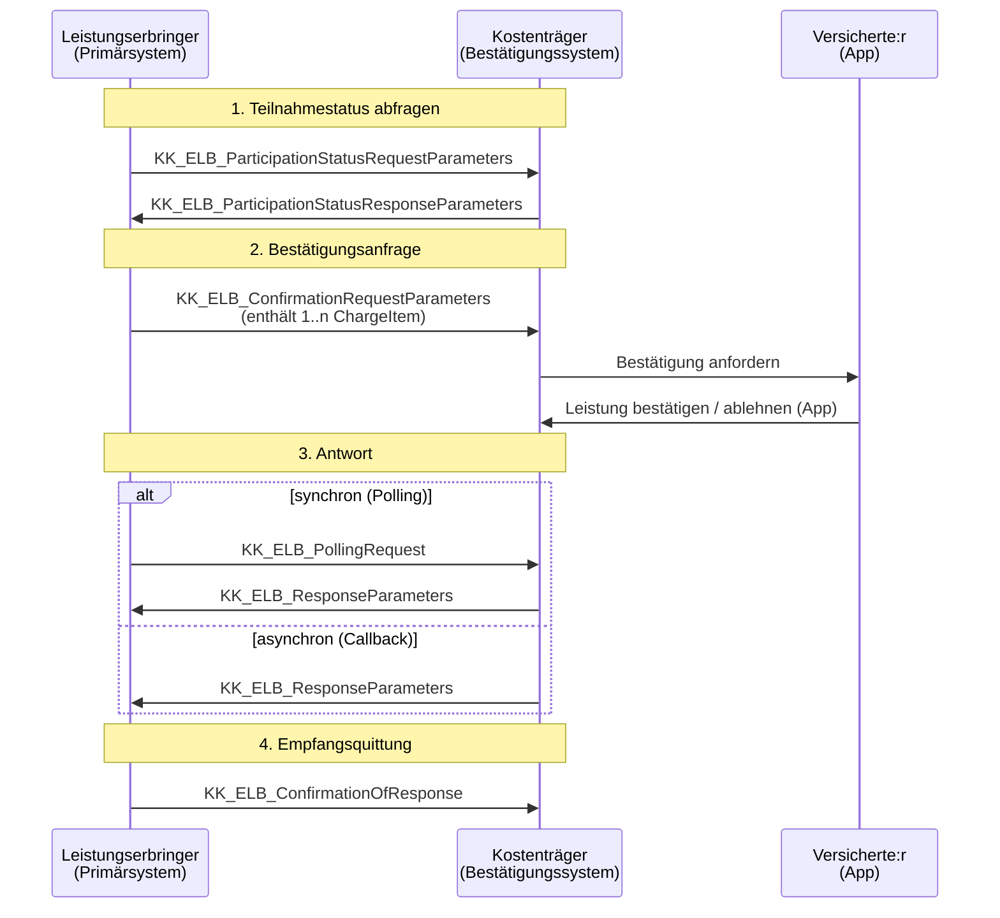

# eLB — Elektronische Leistungsbestätigung

FHIR-Profilset für den elektronischen Austausch von Leistungsbestätigungen zwischen Leistungserbringern der Gesetzlichen Krankenversicherung und Kostenträgern in Deutschland.

Veröffentlichte Spezifikation: [eleistungsbestaetigung.de](https://www.eleistungsbestaetigung.de/)

## Worum geht es?

Die elektronische Leistungsbestätigung löst den papier- und unterschriftsgebundenen Leistungsnachweis ab. Versicherte bestätigen die in Anspruch genommene Leistung gegenüber ihrer Krankenkasse digital; der Leistungserbringer erhält die Bestätigung als FHIR-Dokument und kann seinen Abrechnungsdatensatz aufsetzen.

Das Repository enthält die normativen Bausteine:

- **StructureDefinitions** — Profile auf Ressourcen wie `ChargeItem`, `Composition`, `Bundle`, `ServiceRequest`, `Condition` und auf das `Parameters`-Resource für die Operationen
- **CodeSystems / ValueSets** — eLB-eigene Codelisten (Leistungserbringer-Sammelgruppenschlüssel, Nutzungsbedingungs-Versionen, Heilmittel-Section-Typen, Request-Typen)
- **NamingSystems** — Identifier-Systeme für Belegnummern, ChargeItem-Codes, Heilmittel-Katalogcodes
- **Beispiele** — vollständige Beispiel-Instanzen für jeden Anwendungsfall (Anfrage, Antwort, Polling, Teilnehmerabfrage, Empfangsquittung, Abrechnung)

## Workflows



Die einzelnen Operationen sind als folgende Parameters-Profile modelliert:

| Schritt | Profil | Zweck |
| --- | --- | --- |
| Anfrage | `KK_ELB_ConfirmationRequestParameters` | Leistungserbringer reicht eine oder mehrere `KK_ELB_ChargeItem` zur Bestätigung ein |
| Antwort | `KK_ELB_ResponseParameters` (mit `KK_ELB_ResponseDocumentBundle`) | Kostenträger liefert bestätigte/abgelehnte ChargeItems als signiertes Document-Bundle |
| Polling | `KK_ELB_PollingRequest` | Bei asynchroner Antwort: Abruf des Ergebnisses durch Patient, Kostenträger, Leistungserbringer oder System |
| Empfangsquittung | `KK_ELB_ConfirmationOfResponse` | Bestätigt den Empfang der Antwort beim Leistungserbringer |
| Teilnehmerabfrage | `KK_ELB_ParticipationStatusRequestParameters` / `…ResponseParameters` | Abfrage, welche Kostenträger das eLB-Verfahren aktiv unterstützen |
| Abrechnung | `KK_ELB_BillingContainerParameters` mit `KK_ELB_InvoiceContainerBundle` | Übergang in die §302-Abrechnung |
| Heilmittel-Verordnung | `KK_ELB_HLM_VO_DocumentBundle` mit `…_Composition` und `…_ServiceRequest` | Bringt die ärztliche Verordnung als Dokument mit |

## Abgedeckte Leistungsbereiche

Die Leistungsbereiche werden über das CodeSystem `KK_ELB_SGS` (Leistungserbringer-Sammelgruppenschlüssel) gekennzeichnet:

| Code | Leistungsbereich |
| --- | --- |
| `A` | Leistungserbringer von Hilfsmitteln |
| `B` | Leistungserbringer von Heilmitteln |
| `C` | Leistungserbringer von häuslicher Krankenpflege |
| `D` | Leistungserbringer von Haushaltshilfe |
| `E` | Leistungserbringer von Krankentransporten |
| `F` | Hebammen |
| `R` | Außerklinische Intensivpflege |

## Repository-Struktur

```
eLB/
├── KK_ELB_*.StructureDefinition.xml   # Profile auf FHIR-Ressourcen
├── KK_ELB_CS_*.CodeSystem.xml         # eLB-eigene CodeSystems
├── KK_ELB_VS_*.ValueSet.xml           # eLB-eigene ValueSets
├── KK_ELB_NS_*.NamingSystem.xml       # Identifier-Systeme (SID/OID/URI)
├── KBV_*.xml                          # Eingebundene KBV-Codelisten (ICD-Diagnosesicherheit, Seitenlokalisation)
├── Beispiele/                         # Beispiel-Instanzen
│   ├── ConfirmationRequestParameters*.xml
│   ├── ResponseParameters*.xml
│   ├── PollingRequest/
│   ├── EmpfangsquittungRequest/
│   ├── Teilnehmerabfrage/
│   └── Abrechnung/
├── validate.bat                        # Validierung unter Windows
├── validate.sh                         # Validierung unter Linux/macOS
└── package.json                        # FHIR-IG-Paketmetadaten
```

Namenskonvention: `KK_ELB_` als Präfix für alle eLB-spezifischen Artefakte; CodeSystems mit `CS_`, ValueSets mit `VS_`, NamingSystems mit `NS_`, Extensions mit `EX_`. Sektor-Profile (Heilmittel-Verordnung) tragen den zusätzlichen Suffix `HLM_VO_`, Krankentransport-spezifische Artefakte `Krankentransport`.

## Validierung

Voraussetzungen: Java (JRE 11+) und `curl`. Beim ersten Aufruf wird der [HAPI FHIR Validator (`validator_cli.jar`)](https://github.com/hapifhir/org.hl7.fhir.core/releases/latest) automatisch nach `.validator/` heruntergeladen.

**Windows:**

```cmd
validate.bat
```

**Linux / macOS:**

```bash
chmod +x validate.sh
./validate.sh
```

Beide Skripte führen den Validator über das gesamte Verzeichnis `Beispiele/` aus und binden zur Validierung das aktuelle Verzeichnis als IG sowie das deutsche Basisprofil-Paket `de.basisprofil.r4` ein. Zusätzliche Validator-Argumente lassen sich anhängen, z. B. `./validate.sh -output validation-output.json`.

## Versionen & Abhängigkeiten

- **FHIR-Version:** R4 (4.0.1)
- **Status der Profile:** `draft` — die Spezifikation befindet sich in der Konsolidierung; rückwärtsinkompatible Änderungen sind bis zum ersten stabilen Release möglich
- **Verwendete Basisprofile:**
  - `de.basisprofil.r4` (HL7 Deutschland) — für Identifier-Datentypen wie `identifier-iknr` und `identifier-kvid-10`
  - `KBV_NS_Base_ANR` (Kassenärztliche Bundesvereinigung) — für die lebenslange Arztnummer

Aktuelle Paketversionen sind in `package.json` hinterlegt.

## Mitwirken & Kontakt

Issues und Pull Requests sind willkommen. Inhaltliche Rückfragen zum Verfahren laufen über den auf [eleistungsbestaetigung.de](https://www.eleistungsbestaetigung.de/) angegebenen Kontakt der ITSG.

Beim Einreichen von Profil-Änderungen bitte beachten:

- Profile, CodeSystems, ValueSets und NamingSystems werden als XML eingecheckt; die canonical URL `https://e-lb.de/fhir/StructureDefinition/…` muss zum Dateinamen passen.
- Änderungen mit lokalem Validator (`validate.sh` / `validate.bat`) testen, bevor ein PR eröffnet wird.
- Bei jeder Profil-Änderung das `date`-Feld und ggf. die `version` in `package.json` aktualisieren.

## Lizenz

Hinweise zur Nutzung der eingebundenen KBV-Schlüsseltabellen und der ICD-Wertelisten siehe jeweilige Dateikommentare. Die Spezifikation selbst wird von der ITSG GmbH herausgegeben; Nutzungsbedingungen sind über die Projektwebseite zu beziehen.
